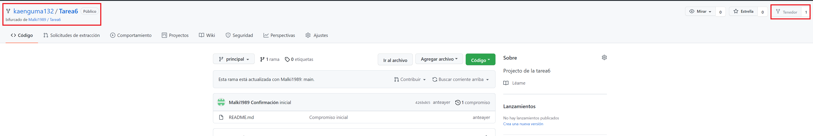
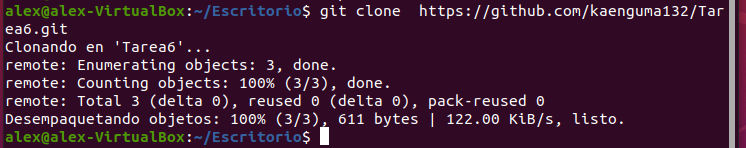
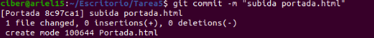
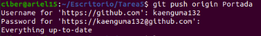
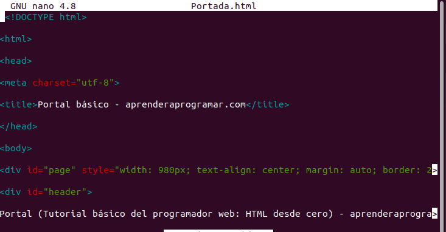
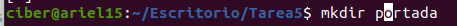
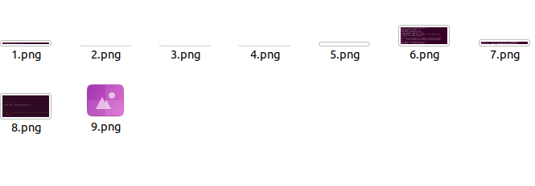

# Tarea 6 #

### Pasos a realizar una subida a una rama "Portada" de Github a traves de fork ###

- Pulsamos en el boton donde pone tenedor en el repositorio de la Tarea 5. Y vemos como se me ha creado correctamente ya que pone 1 donde pone "tenedor" 
   

- Utilizamos el comando **git clone** con el repositorio correspondiente. Una vez clonada, podemos entrar en ella con el comando **cd nombre-del-repositorio**.
   

- Ahora creamos una nueva Rama que se va llamar Portada-Alejandro con el comando **git checkout -b portada-Alejandro** y nos movera automaticamente ha la rama que hemos creado 

- Una vez dentro, crearemos el archivo con el comando de nuestra preferencia **touch/nano/vi** y lo llamaremos portada.html.

- Para añadir el archivo al proyecto tenemos que usar el comando **git add**.
   

- Ejecutamos **git status** para comprobar que si se ha sincronizado correctamente. Si aparece en verde, está todo correcto.
 
- Ahora pasamos a registrar cambios en el historial con el comando **git commit -m "Comentario que queramos poner** y vemos que se ha realizado correctamente 
   

- Ahora toca subir el archivo a Github a través del comando **git push origin portada-Alejandro**.
   

- Ahora tenemos que hacer 4 commit más:

   - El primero será la modificación del archivo portada.html poniendo una estructura básica de una página html.
      

   - Creamos la carpeta portada para las imágenes. 
      

   - Colocamos las imágenes dentro de la carpeta creada anteriormente 
      

