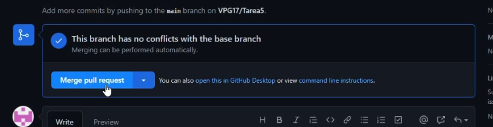

# Tarea6

### Readme - Vicente

- Git fetch

En esta Tarea, cómo la anterior debemos trabajar en equipo, vamos a hacer un Fetch del repositorio original. Esto sirve para poder hacer una copia exacta del repositorio y añadirlo a nuestro GitHub. Se hace pulsando sobre el botón de Fork. En esta práctica no necesitaremos hacer ninguna rama nueva por que trabajamos sobre un "reopsitorio propio" para posteriormente fusionar los cambios.

- Git clone

Ahora sí podemos usar el comando ***git clone nombre_repositorio*** y cambiar a la nueva carpeta para empezar a modificar nuestro proyecto.

- Git add y git commit

Después de realizar los cambios que requería la práctica y he realizado en el vídeo debemos hacer ***git add .***  y después ***git commit*** para dejar estos cambios preparados para subir.

- Git push

Una vez ya tengamos todos los cambios necesarios y estemos preparados para hacer el push, vamos a lanzarlo con el comando ***git push origin main***. No debemos especificar ramas nuevas ya que estamos trabajando "sólos".

- Pull request y merge

Para finalizar, lo que debemos hacer es solicitar un pull request y esperar a que el propietario o encargado del proyecto revise y acepte los cambios que queremos incorporar y fusionar al repositorio original.

